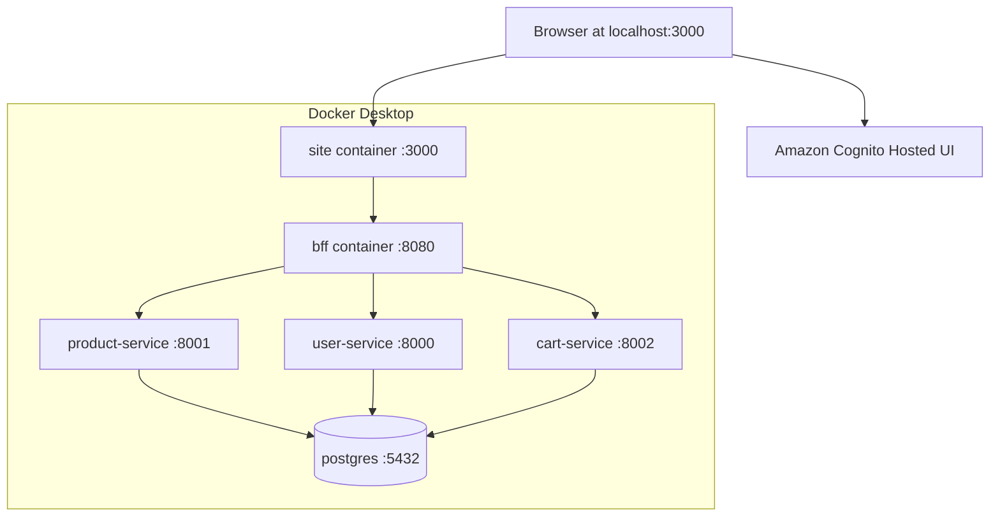

# Local Deployment Architecture

AWS production deployment remains an outstanding requirement. The target is static site hosting with HTTPS, Cognito, containerized BFF and FastAPI services, managed PostgreSQL, CloudWatch logs, budget alerts, and cleanup tags.