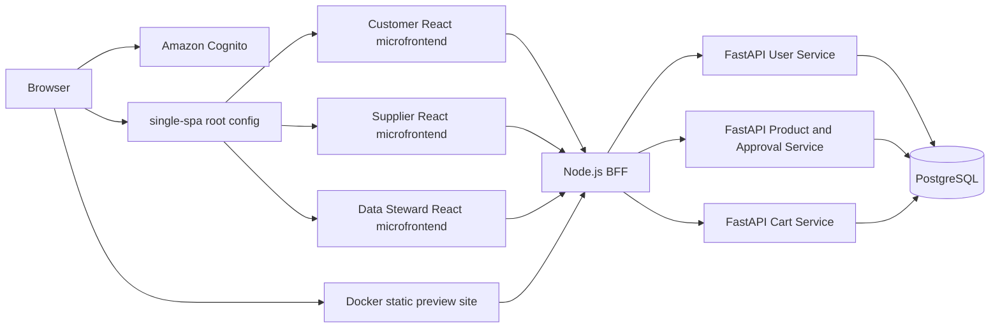

# Logical Architecture

Export: [logical.svg](assets/logical.svg)

The Product Service owns the submission lifecycle, approval decision, rejection reason, and audit records. This is the implemented approval boundary; no separate Approval Service is deployed.