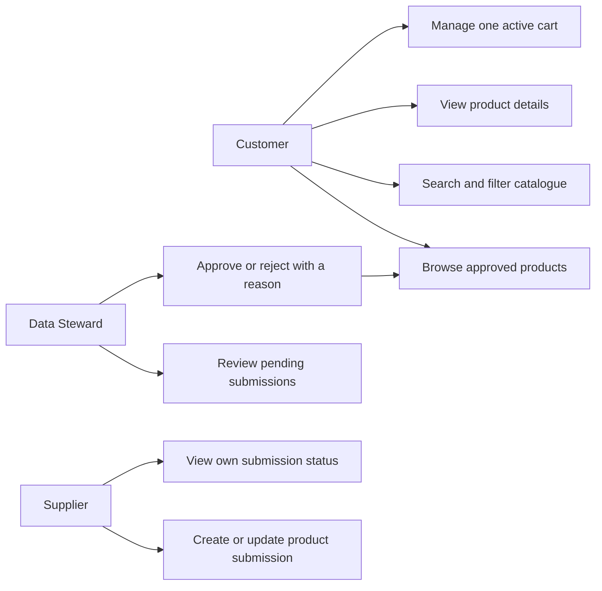

# Food Marketplace Use Cases

```mermaid
flowchart LR
  Customer[Customer]
  Supplier[Supplier]
  Steward[Data Steward]

  Browse[Browse approved products]
  Search[Search and filter catalogue]
  Details[View product details]
  Cart[Manage one active cart]
  Submit[Create or update product submission]
  Status[View own submission status]
  Review[Review pending submissions]
  Decide[Approve or reject with a reason]

  Customer --> Browse
  Customer --> Search
  Customer --> Details
  Customer --> Cart
  Supplier --> Submit
  Supplier --> Status
  Steward --> Review
  Steward --> Decide
  Decide --> Browse
```